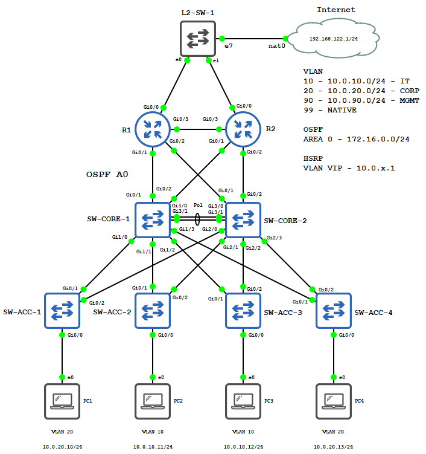

# LABO Automation en Orchestration

Dit labo bevat de basis opstelling voor de modules automation en orchestration.

Er zijn 2 varianten van het labo

- De **base** variant met een basis, correcte config
- De **lab** variant met een basis config met configuratie fouten

Voor de **base** en **lab** opstellingen vind je een labo in de `gns3` map en de respectievelijke startup configs in `startup-configs`. Elk labo is ook voorzien van snapshots.

## Management ip's

```
R1        10.0.100.11
R2        10.0.100.12

SW-CORE-1 10.0.90.251
SW-CORE-2 10.0.90.252

SW-ACC-1  10.0.90.11
SW-ACC-2  10.0.90.12
SW-ACC-3  10.0.90.13
SW-ACC-4  10.0.90.14
```

## Logins en wachtwoorden

Voor alle netwerk toestellen is de login `admin` met wachtwoord `Appel.Sap1`. Het Privileged exec (enable) wachtwoord is `Acti.Vate`.

De Debian machines hebben als login `debian` met wachtwoord `debian`

## Opstelling


Je kan alle startup configuraties vinden in de `startup-config` map. Een voorgeconfigureerd GNS3 labo kan je vinden in de `gns3` map.

## Scripts

Je kan alle gebruikte automation en orchestration scripts vinden op github:

- https://github.com/epiecs/automation-scripts
- https://github.com/epiecs/orchestration-scripts

## Ubuntu VM

> **LET OP:** In het lab dat je downloadt is er een VPCS gebruikt waar de Ubuntu VM dient geplaatst te worden. Naargelang voor welke optie je kiest dien je dit nog aan te passen!

Voor de Ubuntu VM zijn er verschillende mogelijkheden. Je kan de ingebouwde Ubuntu vm gebruiken van GNS3. Een andere mogelijkheid is om een bridge interface toe te voegen aan jouw GNS3 server zodat je rechtstreeks je netwerk kan benaderen met een VM.

### Bridge interface

Om de bridge interface te gebruiken **voeg je eerst een extra netwerk interface toe aan je GNS3 VM.**

Zodra dit in orde is installeer je het pakket `bridge-utils`:

```
sudo apt install bridge-utils -y
```

De volgende stap is de naam van jouw nieuwe netwerk kaart achterhalen:

```bash
ip link show

1: lo: <LOOPBACK,UP,LOWER_UP> mtu 65536 qdisc noqueue state UNKNOWN mode DEFAULT group default qlen 1000
    link/loopback 00:00:00:00:00:00 brd 00:00:00:00:00:00
2: eth0: <BROADCAST,MULTICAST,UP,LOWER_UP> mtu 1500 qdisc fq_codel state UP mode DEFAULT group default qlen 1000
    link/ether 32:ee:fc:79:db:f0 brd ff:ff:ff:ff:ff:ff
    altname enp0s18
    altname ens18
3: eth1: <BROADCAST,MULTICAST,UP,LOWER_UP> mtu 1500 qdisc fq_codel state UP mode DEFAULT group default qlen 1000
    link/ether ae:39:d7:c4:de:31 brd ff:ff:ff:ff:ff:ff
    altname enp0s19
    altname ens19
4: virbr0: <BROADCAST,MULTICAST,UP,LOWER_UP> mtu 1500 qdisc noqueue state UP mode DEFAULT group default qlen 1000
    link/ether 52:54:00:84:f7:c5 brd ff:ff:ff:ff:ff:ff
5: virbr0-nic: <BROADCAST,MULTICAST> mtu 1500 qdisc fq_codel master virbr0 state DOWN mode DEFAULT group default qlen 1000
    link/ether 52:54:00:84:f7:c5 brd ff:ff:ff:ff:ff:ff
6: docker0: <NO-CARRIER,BROADCAST,MULTICAST,UP> mtu 1500 qdisc noqueue state DOWN mode DEFAULT group default
    link/ether 02:42:e7:80:7c:06 brd ff:ff:ff:ff:ff:ff
7: gns3tap0-0: <BROADCAST,MULTICAST,UP,LOWER_UP> mtu 1500 qdisc fq_codel master virbr0 state UNKNOWN mode DEFAULT group default qlen 1000
    link/ether 5a:28:3d:fb:88:e1 brd ff:ff:ff:ff:ff:ff
```

In mijn geval is de naam van de 2de netwerkkaart **eth1**. Noteer dit. Dit is mogelijks anders voor jou.

Voeg de volgende configuratie toe aan het bestand `/etc/netplan/100-gns3-bridge.yaml`. Dit bestand bestaat standaar niet. Je kan dit bestand aanmaken:

```bash
sudo nano /etc/netplan/100-gns3-bridge.yaml
```

**Pas `eth1` aan naar de naam van jouw netwerkkaart!**

```yaml
network:
  version: 2
  renderer: networkd
  ethernets:
    eth1:
      dhcp4: no
      dhcp6: no
  bridges:
    gns3bridge:
      dhcp4: yes
      interfaces:
        - eth1
```

Sla dit bestand op met `ctrl + o` en dan `ctrl + x`.

Je kan nu de configuratie toepassen:

```bash
sudo netplan apply
```

Als alles correct verlopen is kan je nu de network interface zien wanneer je `ip link show` uitvoert.

### De bridge interface toevoegen in GNS3

In de GNS3 interface ga je naar `edit > preferences` en kies je in de linkermenu voor `cloud nodes`. Voeg een nieuwe interface toe en noem deze `LAB-BRIDGE`.

Pas deze nu aan en selecteer `show special ethernet interfaces` en kies dan onze `gns3bridge` interface. Vergeet niet op **add** te klikken om deze toe te voegen:


Onder het tabblad `Misc.` Kan je indien gewenst de naam en het icoon aanpassen. Dit is puur esthetisch. In mijn geval kies ik voor `Bridge-{0}` en `:/symbols/affinity/circle/blue/laptop.svg`:


### De Ubuntu VM verbinden

Je kan nu de Ubuntu VPCS aanpassen naar jouw bridge. De beste manier is om jouw Ubuntu VM te voorzien van een extra netwerk kaart. Verbind deze met hetzelfde netwerk als de bridge interface en geef deze als statisch ip `10.0.20.10/24`. Als alles correct verlopen is kan je alle management ips bereiken.

Een voorbeeld netplan configuratie vind je hieronder, **hou weer rekening met de naam van jouw netwerkkaart**:

```bash
sudo nano /etc/netplan/100-gns3-lab.yaml
```

```yaml
network:
  version: 2
  renderer: networkd
  ethernets:
    ens19:
      dhcp4: no
      addresses:
        - 10.0.20.10/24
      nameservers:
        addresses: [9.9.9.9]
      routes:
      - to: 192.168.122.0/24
        via: 10.0.20.1
      - to: 172.16.0.0/24
        via: 10.0.20.1
      - to: 10.0.0.0/16
        via: 10.0.20.1
```

Vergeet niet je settings te saven met `sudo netplan apply`.

> Merk op dat we de routes hebben toegevoegd. Het is aan jou om zeker te zijn dat er geen conflicten zijn met jouw eigen labo.

### Bridge interface met ESXI

Indien je gebruik maakt van esxi dien je enkele aanpassingen uit te voeren. Voer de volgende aanpassingen door op de port group die verbonden is met de extra GNS3 interface:

- Promiscuous mode accept
- MAC address changes accept
- Forged transmits accept

De interface die je toekent aan GNS3 dient van het type **E1000** te zijn.

## Devices

* 1 x Internet toegang
* 1 x L2 SW
* 2 x IOSv
* 6 x IOSvL2
* 3 x Debian machines
* 1 x Ubuntu machine
  * De Ubuntu machine is verbonden via een cloud node. Zodoende kan je je eigen virtuele machine gebruiken binnen GNS3

> VPCS werken niet omdat deze allemaal hetzelfde mac adres hebben.

## Verificatie

Als de basis opstelling correct uitgevoerd is kan de ubuntu machine het management ip van elk toestel pingen.

## Configuratie fouten in lab

> **Let op:** De native vlan mismatch tussen `SW-CORE-01` en `SW-ACC-02` brengt een enorme cpu belasting met zich mee. Dit kan na een tijdje jouw lab doen crashen indien je niet genoeg resources hebt. Zie daarom dat je pas de link terug inschakelt nadat je de native vlan mismatch hebt verholpen

- R1
  - g0/0 is geen passive interface
- R2
  - g0/0 shutdown
  - hostname Router1
- SW-CORE-01
  - g1/1 native vlan mismatch
- SW-CORE-02
  - g2/2 trunk laat enkel vlan 10 toe
  - g2/3 trunk laat enkel vlan 10 toe
- SW-ACC-1
  - hostname Switch1
- SW-ACC-2
  - g0/1 shutdown
- SW-ACC-3
  - vlan 10 noemt CORP
- SW-ACC-4
  - stp root bridge voor alle vlans (prio 8192)
  

